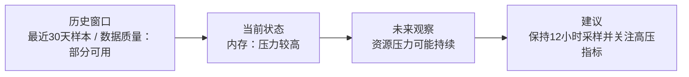

# Trend Mermaid Text v1

## Background

The trend enhancement subchain is already offline-first and currently produces:

- `trend_input.json`
- `trend_assessment.json`
- `trend_summary.md`
- optional metric PNG charts when at least two samples exist
- optional `augmented_report.docx`

The next report-facing improvement is to add a lightweight Mermaid state graph that explains historical evidence, current status, and future risk direction in a more visual way. This round only defines and emits Mermaid text. Mermaid-to-PNG rendering and Word insertion are deferred to a later optional renderer round.

## Goal

Generate a Mermaid graph from `trend_assessment.json` and include it in the existing trend summary output.

The intended first output is:

```text
trend_assessment.json
  -> trend_state_graph.mmd
  -> trend_summary.md with embedded Mermaid block
```

## Scope

In scope:

- Add a small Mermaid text renderer for trend assessment results.
- Generate one `flowchart LR` style state graph.
- Represent:
  - historical window / evidence quality
  - current status
  - future observation / risk direction
  - recommended follow-up
- Use existing status values:
  - `stable`
  - `pressure_high`
  - `deteriorating`
  - `unknown`
- Keep wording conservative and rule-driven.
- Make the graph's main expression focus on the current highest-risk metric so the total view does not dilute the most important signal.
- Persist Mermaid source as both `workdir/trd_*/trend_state_graph.mmd` and `outputs/trd_*/trend_state_graph.mmd`.
- Embed the same Mermaid block into `trend_summary.md`.
- Add short text before and after the Mermaid block explaining that it is a state/risk-direction graph, not a precise numeric prediction chart.
- Add tests for graph generation and end-to-end artifact creation.

## Out Of Scope

- No Mermaid CLI.
- No PNG/SVG rendering.
- No Word insertion in this round.
- No `/api/tasks` changes.
- No xray changes.
- No `waf_audits` changes.
- No new endpoint.
- No LLM prediction.
- No complex time-series model.
- No numeric future extrapolation.

## Proposed Files

Potential new file:

- `app/services/trend_mermaid_renderer.py`

Potential updated files:

- `app/services/trend_enhancement_service.py`
- `app/services/trend_summary_renderer.py`
- `app/schemas/trend_assessment.py` only if artifact metadata requires a minimal extension; avoid unless necessary.
- `tests/test_trend_mermaid_renderer.py`
- `tests/test_trend_enhancement_service.py`
- `README.md`
- `docs/project_status.md`

## Graph Shape v1

Use one compact `flowchart LR`:



Status wording:

- `stable`: short-term state appears stable; continue regular observation.
- `pressure_high`: pressure is already high; continue focused observation and capacity/process checks.
- `deteriorating`: evidence suggests worsening direction; prioritize follow-up.
- `unknown`: evidence is insufficient; collect more time points before stronger judgment.

## Persistence Convention

For a trend run `trd_*`, write:

```text
workdir/trd_*/trend_state_graph.mmd
outputs/trd_*/trend_state_graph.mmd
workdir/trd_*/trend_summary.md
```

The `.mmd` file contains only Mermaid source. The markdown summary embeds the same source inside:

````markdown
## 状态趋势图

这是一张状态说明图 / 风险方向图，不是精确数值预测图。

```mermaid
...
```

图中的未来观察节点来自规则驱动的趋势判断，不代表未来资源数值外推。
````

## Testing Plan

Add tests covering:

- `stable` produces conservative stable wording.
- `pressure_high` produces high-pressure future-observation wording.
- `deteriorating` produces worsening-risk wording.
- `unknown` produces insufficient-evidence wording.
- Mermaid text is saved as `trend_state_graph.mmd`.
- Mermaid text is saved to both `workdir/trd_*` and `outputs/trd_*`.
- `trend_summary.md` includes a Mermaid fenced code block.
- `trend_summary.md` includes usage/boundary wording around the Mermaid graph.
- Existing chart behavior remains unchanged.

## Acceptance Criteria

- A trend run produces `workdir/trd_*/trend_state_graph.mmd` and `outputs/trd_*/trend_state_graph.mmd`.
- `trend_summary.md` includes a Mermaid graph section.
- The graph focuses on the highest-risk metric.
- No external Mermaid runtime is required.
- Existing trend tests and full repository tests pass.
- The implementation remains an offline-first trend subchain enhancement only.

## Future Round

After the Mermaid text shape is accepted, add an optional image rendering round:

```text
trend_state_graph.mmd
  -> optional mermaid-cli / mmdc
  -> trend_state_graph.png
  -> augmented_report.docx
```

That future round should keep `mmdc` optional so missing Node.js / Chromium does not break the text-only trend workflow.
